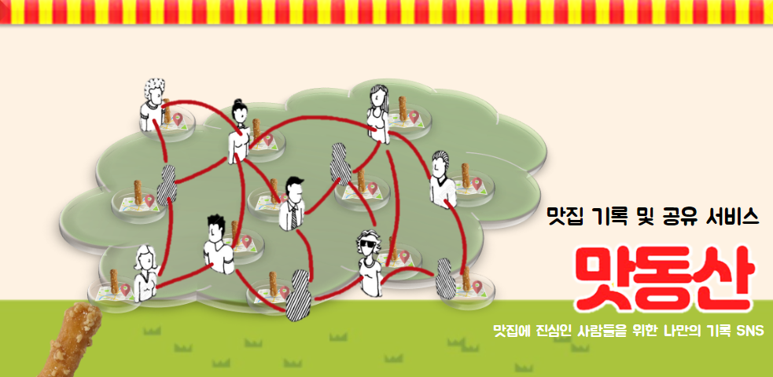
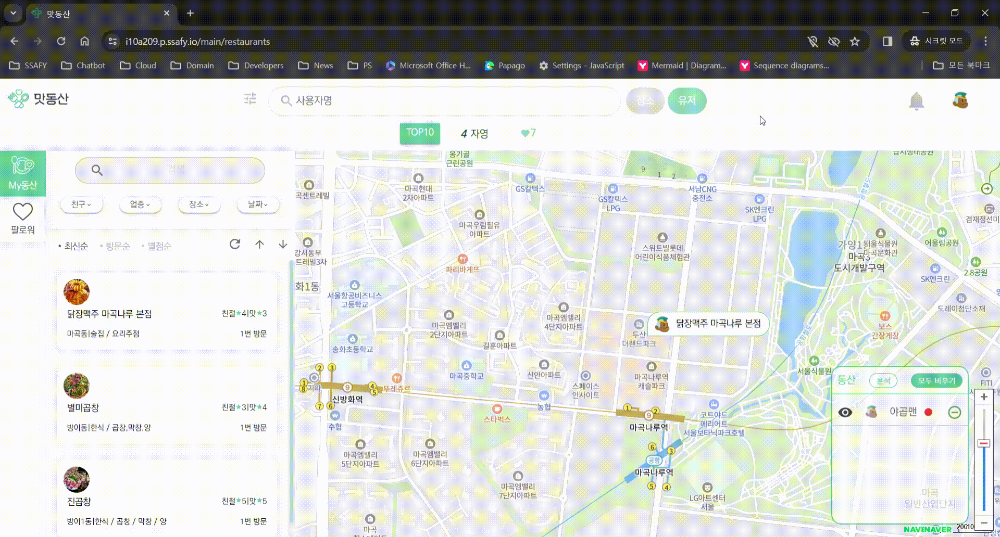
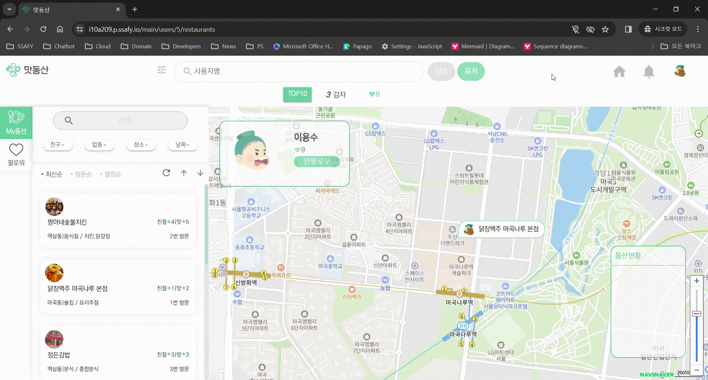
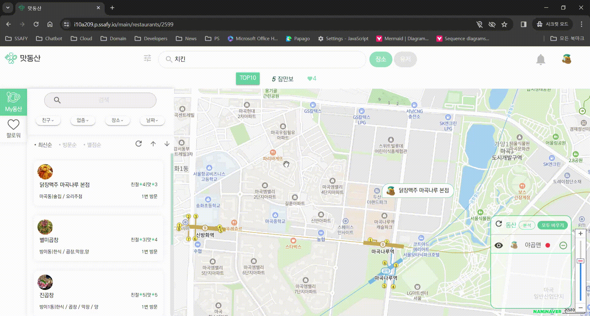

# 맛동산

맛동산은 음식점을 방문한 후 남기는 기록을 쉽게 다시 찾아보거나 다른 사람들과 공유하기를 원하는 사용자들을 위해 탄생했습니다.

맛동산과 함께 맛있는 추억을 남겨보세요!

# 🗓️ 프로젝트 기간

- 2023.01.08(월) ~ 2023.02.16(금)

# 👥 팀 구성

- 팀장
    - 이다은 (FE)
- 팀원
    - 차민재 (FE)
    - 조형준 (BE)
    - 이용수 (FE)
    - 최자영 (BE)

# 💫 기획 의도와 목적

> 네이버지도, 카카오지도를 이용해 한국 곳곳에 있는 맛집을 검색할 수는 있다.
하지만, 맛집에 관한 메모는 텍스트 형식이라 필터나 검색에 제한이 되고, 평가는 개개인의 기준점이 달라 같은 5점이라도 신뢰도가 차이가 난다.
우리는 기존에 텍스트 형식으로만 작성되던 맛집에 대한 메모를 개선하고 리뷰보다는 개인의 기록이라는 의도로 접근하며 가게에 대한 평가는 가중치를 적용해 좀 더 신뢰성 있는 평가로 변경하려 한다.
> 

## 1. 배경

- 네이버 지도, 카카오 지도 서비스에서 기록에 대한 기능이 부족하다고 느낌
- 평점 기능이 있으나 단순 수치이기 때문에 신뢰하기 어려운 경우가 많음

## 2. 목표

- 내가 방문한 장소에 대해 쉽고 구체적으로 기록할 수 있는 기능을 제공한다.
- 사용자 간에 기록을 공유할 수 있도록 한다.
- 축적된 데이터를 기반으로 기존의 서비스를 보다 신뢰할 수 있는 추천 목록을 제공한다.

---

# 🍽️ 맛동산 주요 서비스 개요

## 메인 페이지

- 검색기능
    - 장소 검색 기능
    - 유저 검색 기능
    - 검색 시 지도 페이지로 이동
- 안내
    - 우리 서비스에 대한 간략한 설명
- 인플루언서
    - 중앙에 팔로워 수가 많은 유저 랭킹 관리
    - 해당 유저 클릭 시 해당 유저의 장소를 탐색 가능

## 인증 인가

- 회원가입
    - 소셜 회원가입(카카오톡, 네이버 로그인은 옵션)
- 로그인
    - 소셜 로그인
- 마이페이지
    - 닉네임 변경
    - 프로필 사진 변경
    - 팔로워 수 및 팔로워 확인

## 지도 페이지

- 검색
    - 필터기반 검색(유저, 장소 등)
    - 장소 검색 시 지도에 해당 장소를 마커로 표시
    - 유저 검색 시 좌측 네비게이션 상태창에 해당 유저의 프로필 검색
- 기록
    - 특정 장소에 기록 가능
    - 친구, 가게이름, 날짜, 리뷰, 가게 주소를 장소에 메모할 수 있도록 설정한다.
    - 단, 같이 간 친구인 경우에는 공개, 비공개를 설정한다.(비공개시 모두에게 비공개)
- 팔로우
    - 팔로우탭에서는 사용자의 구독 목록만 검색할 수 있도록한다.(인스타 벤치마킹)
    - 해당 구독자 클릭 시 해당 유저의 저장한 장소를 지도에 불러온다.
- 탐색
    - 사용자의 장소를 상세 검색할 수 있는 필터를 제공한다.
    - 기간 설정
    - 장소
    - 종류
    - 간이 간 사람
- 지도
    - 지도에 내가 간 장소를 마커로 표시한다.
    - 팔로우 한 사람 클릭 시 장소를 불러온다.
    - 2개의 토글 버튼을 두고, 내가 간 곳을 빼거나, 같이 간곳만 표시하는 1대1 비교 기능을 제공한다.
    - 사용자 정보만 지도에 표시 시 모든 필터링 버튼을 막는다.

모든 서비스는 지도에 장소 검색을 제외하고 로그인을 해야 서비스를 이용 가능하도록 설정한다.

## 주요 링크

[메인 페이지](http://i10a209.p.ssafy.io/)

[소개 영상](https://youtu.be/jF2EbYaSVDc?si=xOxmrc3Wdxsfr1W8)

# 주요 기능

- `계정` 검색하기
- `계정` 구독하기
- `음식점` 검색하기
- `음식점` 저장하기
- `리뷰` 기록하기
- `리뷰` 검색하기
- 여러 계정의 `저장한 음식점` / `리뷰` 동시에 보기

# 개발 환경

**Management Tool**

**IDE**

**Infra**

**Frontend**

**Backend**

# 서비스 화면

### 로그인 + 회원가입

### 계정 검색하기

### 계정 구독하기

### 음식점 검색하기 + 저장하기

### 리뷰 작성하기

### 리뷰 검색하기

### 여러 계정의 저장한 음식점 + 리뷰 동시에 보기

